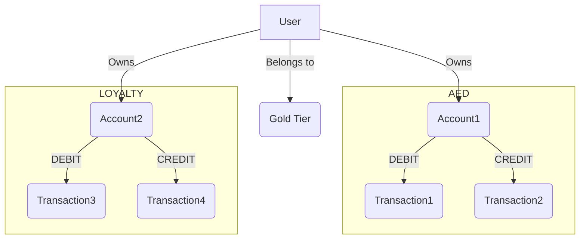

# Digital Wallet
This is a Proof of Concept for a digital wallet system. The system is built using Go and PostgreSQL.
The system lets you create multiple wallets (e.g. Store Credit, Loyalty Points, Credit line Wallet, Payouts Wallet...etc.)
Each user can have an account in each wallet and can perform transactions (DEBIT/CREDIT) on the account. The account holds the balance of the user in the wallet.
The system also supports multiple user tiers (e.g. basic, premium, enterprise) and each tier can have different limits on the wallet balance and different exchange rates between the wallets.
The system also supports automating reward programs by making event based rule based engine that can trigger transactions based on the events.



You can see the ERD of the system in the `docs/ERD.md` file. and system design in the `docs/system-design.md` file.


## Setup

Clone the repository

```
git clone https://github.com/abdelrahman146/digital-wallet.git
```

Change the directory

```
cd digital-wallet
```

Install the dependencies

```
go mod tidy
```

Create a `.env` by copying the `.env.example` file

```
cp .env.example .env
```

Make sure you have a running PostgreSQL server and update the `.env` file with your database credentials
Run the migrations

install the migrate tool
```
curl -L https://github.com/golang-migrate/migrate/releases/download/$version/migrate.$os-$arch.tar.gz | tar xvz
```

```
make migrate-up
```

Copy the content inside docs/swagger.yaml
Open postman and click on import and paste the content
You can now a colleaction of all the endpoints
Run the server

```
make dev
```

The server will be running on `http://localhost:3401`

## API Documentation

The API documentation is available at `http://localhost:3401/swagger/index.html`

## How to try the project

You can try the project by using the postman collection and the API documentation

1. You can create different users by using the `POST /api/v1/backoffice/users` endpoint
2. You can create user tiers such as `basic`, `premium`, and `enterprise` by using the `POST /api/v1/backoffice/tiers`
   endpoint
2. You can then create multiple wallets by using the `POST /api/v1/backoffice/wallets` endpoint
3. You can then create users accounts in each wallet by using the `POST /api/v1/backoffice/accounts` endpoint
4. You can then create transactions (DEBIT/CREDIT) the accounts by using
   the `POST /api/v1/backoffice/wallet/{walletId}/transactions` endpoint.
5. You can then get the balance of the account by using
   the `GET /api/v1/backoffice/wallet/{walletId}/accounts/{account_id}` endpoint

There are many other endpoints that you can try in the postman collection. You can also check the API documentation for
more information.
One interesting endpoint is the `POST /api/v1/backoffice/wallet/{walletId}/check-integrity` endpoint which checks the
integrity of the wallet by calculating the sum of all the wallet accounts and the sum of the transactions and the diff
should 0.

## Check List
- [x] Wallets
- [x] Tiers
- [x] Users & Accounts
- [x] Transactions / Exchange / Points Expiry
- [x] Audit and Integrity Check
- [x] Triggers
- [ ] Programs
- [ ] User API
- [ ] Tests

## To Generate Mocks 
```
go install go.uber.org/mock/mockgen@latest
```
then run the following command
```
make gen-mocks
```