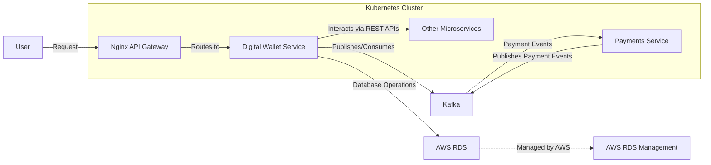

# Digital Wallet System

## Introduction

The **Digital Wallet System** is a robust, secure, and scalable component for e-commerce platforms, designed to handle financial transactions with the highest level of integrity, consistency, and transparency. It supports a wide range of operations, including deposits, withdrawals, purchases, refunds, and peer-to-peer transfers. This system is built using Go, Fiber, and GORM, ensuring efficiency and high performance even under heavy load. Additionally, we implement Rate Limiting, Transaction Queuing with Kafka, and Anomaly Detection to further enhance security, reliability, and system robustness.

## Functionality and Benefits

The Digital Wallet System provides users with a seamless experience for managing their balances, whether they are topping up, making purchases, or transferring funds to other users. The system is engineered to prevent common issues such as double spending, race conditions, data inconsistencies, and abuse, making it reliable for real-world applications with a high volume of transactions.

## Features and System Requirements

### 1. **Security**
- **Data Encryption**: Sensitive data, including financial transactions, is encrypted both at rest and in transit, ensuring that user information remains secure.
- **Rate Limiting**: Rate limiting is implemented to prevent abuse and protect against potential attacks, ensuring that no user can overwhelm the system with excessive requests.
- **Role-Based Access Control (RBAC)**: Access to financial data is restricted based on user roles, ensuring that only authorized personnel can perform critical operations.
- **Audit Logging**: Comprehensive logging of all transactions and access to sensitive data provides a complete audit trail for monitoring and compliance.

### 2. **Integrity**
- **Atomic Transactions**: All balance-altering operations (deposits, withdrawals, purchases, refunds, transfers) are executed atomically, ensuring that the system remains in a consistent state even in the event of a failure.
- **Optimistic Concurrency Control**: The use of versioning ensures that simultaneous updates to a user's balance do not lead to inconsistencies or lost updates.
- **Transaction Queuing with Kafka**: Kafka is used to ensure that transactions are processed in the correct order and that no data is lost, even under heavy load or in the event of system failures.

### 3. **Consistency**
- **Serializable Isolation**: The system operates at the highest level of transaction isolation, preventing anomalies like dirty reads, non-repeatable reads, and phantom reads.
- **Consistency Checks**: Regular checks are implemented to ensure that the sum of all balances equals the total of all deposits minus withdrawals, ensuring that the system remains accurate.
- **Anomaly Detection**: A simple anomaly detection mechanism is implemented to monitor transactions and flag unusual patterns that could indicate potential fraud or system errors. This can be enhanced as needed.

### 4. **Transparency**
- **Detailed Transaction Logging**: Each transaction is logged with comprehensive details, including who initiated it, the type of transaction, and any associated bank transaction IDs. This transparency helps in auditing and understanding the flow of funds.
- **Monitoring**: A consistency check API is provided to ensure that the overall system remains balanced and transparent to administrators.

### 5. **Scalability**
- **Horizontal Scaling**: The system is designed to scale horizontally, with support for database sharding and read replicas to handle high traffic.
- **Partitioning and Caching**: Partitioning strategies for large tables and the use of in-memory caches help to ensure that the system remains performant as the number of users grows.

### 6. **Efficiency**
- **Optimized Database Operations**: The use of partitioning, indexing, and efficient query design ensures that the system can handle a large number of transactions with minimal latency.
- **Asynchronous Processing with Kafka**: By using Kafka for transaction queuing, the system can handle large volumes of transactions asynchronously, ensuring efficiency and order without sacrificing data integrity.

### 7. **Concurrency**
- **Pessimistic Locking**: To prevent race conditions during critical balance updates, pessimistic locking is employed, ensuring that no two transactions can update the same balance simultaneously.
- **Optimistic Concurrency Control**: The versioning mechanism also helps in managing concurrent transactions, allowing the system to handle high levels of concurrency without sacrificing data integrity.

## System Design
The Digital Wallet System is architected to be highly scalable, secure, and resilient, leveraging modern cloud-native technologies. It is containerized and orchestrated in a Kubernetes cluster, which ensures seamless scaling and management of microservices. Below is a detailed explanation of the system design:

## API Endpoints

The Digital Wallet System provides the following REST APIs:

### 1. **Deposit**
- **Endpoint**: `POST /deposit`
- **Description**: Adds funds to a user's balance.
- **Parameters**:
    - `user_id` (required): The ID of the user.
    - `amount` (required): The amount to be deposited.
    - `bank_transaction_id` (optional): The associated bank transaction ID.
    - `initiated_by` (required): The ID of the initiator (user, support, or system).
- **Response**: Success or error message.

### 2. **Withdraw**
- **Endpoint**: `POST /withdraw`
- **Description**: Deducts funds from a user's balance.
- **Parameters**:
    - `user_id` (required): The ID of the user.
    - `amount` (required): The amount to be withdrawn.
    - `bank_transaction_id` (optional): The associated bank transaction ID.
    - `initiated_by` (required): The ID of the initiator (user, support, or system).
- **Response**: Success or error message.

### 3. **Purchase**
- **Endpoint**: `POST /purchase`
- **Description**: Deducts funds from a user's balance for a purchase.
- **Parameters**:
    - `user_id` (required): The ID of the user.
    - `amount` (required): The amount to be deducted.
    - `bank_transaction_id` (optional): The associated bank transaction ID.
    - `initiated_by` (required): The ID of the initiator (user, support, or system).
- **Response**: Success or error message.

### 4. **Refund**
- **Endpoint**: `POST /refund`
- **Description**: Adds a refund to a user's balance.
- **Parameters**:
    - `user_id` (required): The ID of the user.
    - `amount` (required): The amount to be refunded.
    - `bank_transaction_id` (optional): The associated bank transaction ID.
    - `related_order_id` (optional): The associated order ID for the refund.
    - `initiated_by` (required): The ID of the initiator (user, support, or system).
- **Response**: Success or error message.

### 5. **Transfer**
- **Endpoint**: `POST /transfer`
- **Description**: Transfers funds between users.
- **Parameters**:
    - `from_user_id` (required): The ID of the sender.
    - `to_user_id` (required): The ID of the receiver.
    - `amount` (required): The amount to be transferred.
    - `initiated_by` (required): The ID of the initiator (user, support, or system).
- **Response**: Success or error message.

### 6. **Consistency Check**
- **Endpoint**: `GET /consistency-check`
- **Description**: Checks the consistency of the system, ensuring that the sum of all balances equals the total of all deposits minus withdrawals.
- **Response**: A message indicating whether the system is consistent or not.

## Conclusion

The Digital Wallet System is designed to be a reliable, secure, and scalable solution for handling financial transactions in a high-traffic environment. By leveraging best practices in database design, concurrency management, transaction processing, rate limiting, and anomaly detection, the system ensures that user balances are always accurate, consistent, and protected against common threats. The provided APIs are easy to use and integrate, making the Digital Wallet System a flexible component of your broader platform.

---

This README file now includes the additional security and reliability features of Rate Limiting, Transaction Queuing with Kafka, and Anomaly Detection, providing a comprehensive overview of the digital wallet system and its capabilities.