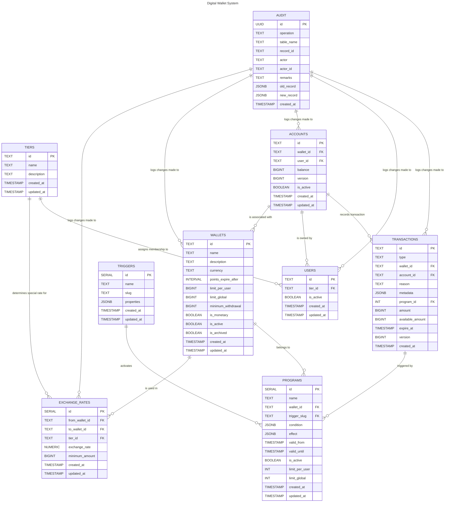

```mermaid
---
title: Digital Wallet System
---
erDiagram
    AUDIT {
        UUID id PK
        TEXT operation
        TEXT table_name
        TEXT record_id
        TEXT actor
        TEXT actor_id
        TEXT remarks
        JSONB old_record
        JSONB new_record
        TIMESTAMP created_at
    }

    WALLETS {
        TEXT id PK
        TEXT name
        TEXT description
        TEXT currency
        INTERVAL points_expire_after
        BIGINT limit_per_user
        BIGINT limit_global
        BIGINT minimum_withdrawal
        BOOLEAN is_monetary
        BOOLEAN is_active
        BOOLEAN is_archived
        TIMESTAMP created_at
        TIMESTAMP updated_at
    }

    TIERS {
        TEXT id PK
        TEXT name
        TEXT description
        TIMESTAMP created_at
        TIMESTAMP updated_at
    }

    USERS {
        TEXT id PK
        TEXT tier_id FK
        BOOLEAN is_active
        TIMESTAMP created_at
        TIMESTAMP updated_at
    }

    EXCHANGE_RATES {
        SERIAL id PK
        TEXT from_wallet_id FK
        TEXT to_wallet_id FK
        TEXT tier_id FK
        NUMERIC exchange_rate
        BIGINT minimum_amount
        TIMESTAMP created_at
        TIMESTAMP updated_at
    }

    TRIGGERS {
        SERIAL id PK
        TEXT name
        TEXT slug
        JSONB properties
        TIMESTAMP created_at
        TIMESTAMP updated_at
    }

    PROGRAMS {
        SERIAL id PK
        TEXT name
        TEXT wallet_id FK
        TEXT trigger_slug FK
        JSONB condition
        JSONB effect
        TIMESTAMP valid_from
        TIMESTAMP valid_until
        BOOLEAN is_active
        INT limit_per_user
        INT limit_global
        TIMESTAMP created_at
        TIMESTAMP updated_at
    }

    ACCOUNTS {
        TEXT id PK
        TEXT wallet_id FK
        TEXT user_id FK
        BIGINT balance
        BIGINT version
        BOOLEAN is_active
        TIMESTAMP created_at
        TIMESTAMP updated_at
    }

    TRANSACTIONS {
        TEXT id PK
        TEXT type
        TEXT wallet_id FK
        TEXT account_id FK
        TEXT reason
        JSONB metadata
        INT program_id FK
        BIGINT amount
        BIGINT available_amount
        TIMESTAMP expire_at
        BIGINT version
        TIMESTAMP created_at
    }

    ACCOUNTS ||--o{ TRANSACTIONS : "records transaction"
    ACCOUNTS ||--o{ USERS : "is owned by"
    ACCOUNTS ||--o{ WALLETS : "is associated with"
    WALLETS ||--o{ PROGRAMS : "belongs to"
    WALLETS ||--o{ EXCHANGE_RATES : "is used in"
    TIERS ||--o{ USERS : "assigns membership to"
    TIERS ||--o{ EXCHANGE_RATES : "determines special rate for"
    TRIGGERS ||--o{ PROGRAMS : "activates"
    TRANSACTIONS ||--o{ PROGRAMS : "triggered by"
    AUDIT ||--o{ TRANSACTIONS : "logs changes made to"
    AUDIT ||--o{ USERS : "logs changes made to"
    AUDIT ||--o{ ACCOUNTS : "logs changes made to"
    AUDIT ||--o{ WALLETS : "logs changes made to"
    AUDIT ||--o{ EXCHANGE_RATES : "logs changes made to"
```