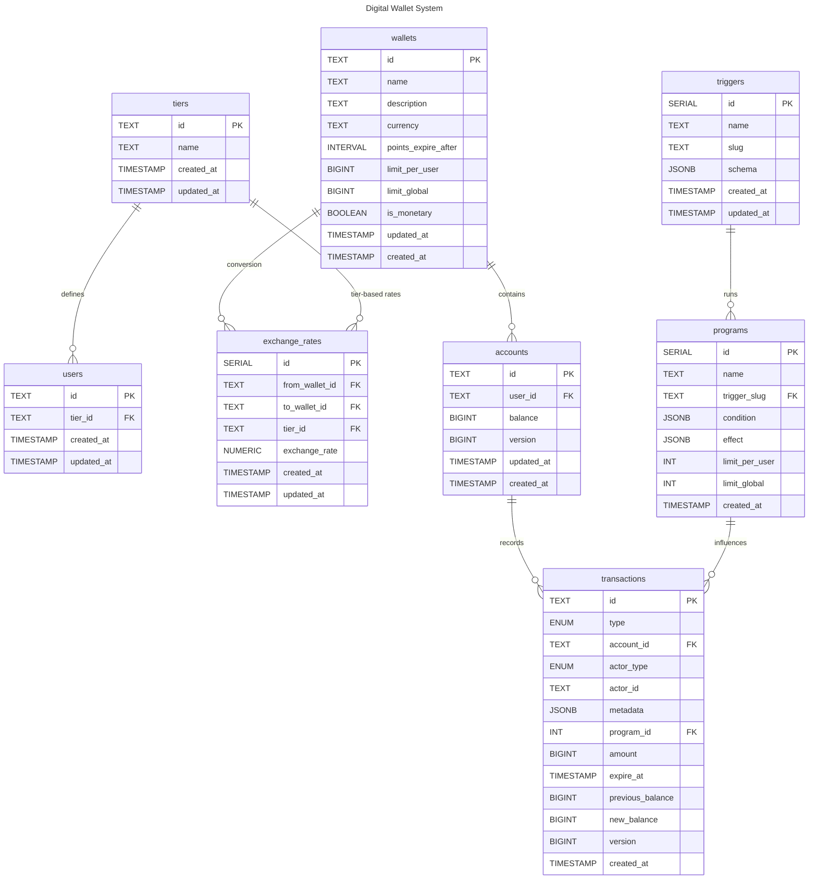

```mermaid
---
title: Digital Wallet System
---
erDiagram
    wallets {
        TEXT id PK
        TEXT name
        TEXT description
        TEXT currency
        INTERVAL points_expire_after
        BIGINT limit_per_user
        BIGINT limit_global
        BOOLEAN is_monetary
        TIMESTAMP updated_at
        TIMESTAMP created_at
    }

    tiers {
        TEXT id PK
        TEXT name
        TIMESTAMP created_at
        TIMESTAMP updated_at
    }

    users {
        TEXT id PK
        TEXT tier_id FK
        TIMESTAMP created_at
        TIMESTAMP updated_at
    }

    exchange_rates {
        SERIAL id PK
        TEXT from_wallet_id FK
        TEXT to_wallet_id FK
        TEXT tier_id FK
        NUMERIC exchange_rate
        TIMESTAMP created_at
        TIMESTAMP updated_at
    }

    triggers {
        SERIAL id PK
        TEXT name
        TEXT slug
        JSONB schema
        TIMESTAMP created_at
        TIMESTAMP updated_at
    }

    accounts {
        TEXT id PK
        TEXT user_id FK
        BIGINT balance
        BIGINT version
        TIMESTAMP updated_at
        TIMESTAMP created_at
    }

    programs {
        SERIAL id PK
        TEXT name
        TEXT trigger_slug FK
        JSONB condition
        JSONB effect
        INT limit_per_user
        INT limit_global
        TIMESTAMP created_at
    }

    transactions {
        TEXT id PK
        ENUM type
        TEXT account_id FK
        ENUM actor_type
        TEXT actor_id
        JSONB metadata
        INT program_id FK
        BIGINT amount
        TIMESTAMP expire_at
        BIGINT previous_balance
        BIGINT new_balance
        BIGINT version
        TIMESTAMP created_at
    }

%% Relationships organized by domains
    tiers ||--o{ users: "defines"
    wallets ||--o{ accounts: "contains"
    accounts ||--o{ transactions: "records"
    triggers ||--o{ programs: "runs"
    programs ||--o{ transactions: "influences"
    wallets ||--o{ exchange_rates: "conversion"
    tiers ||--o{ exchange_rates: "tier-based rates"

```