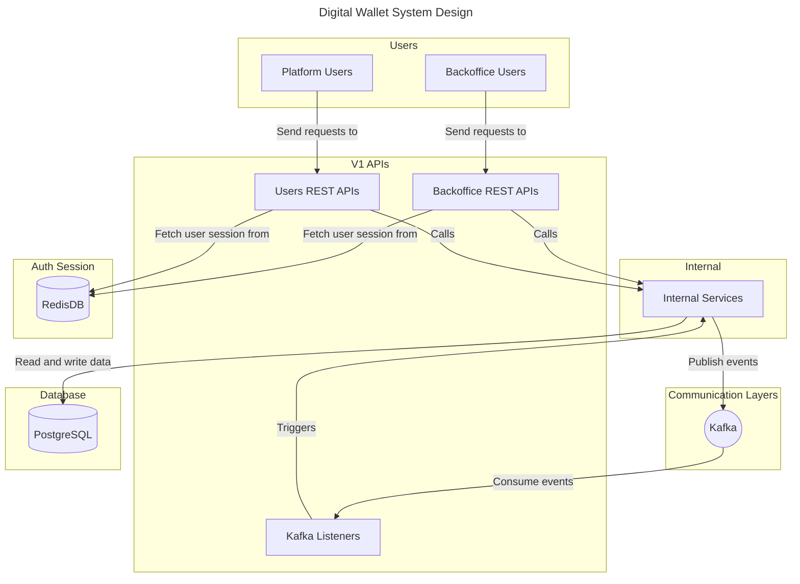

```mermaid
---
title: Digital Wallet System Design
---
flowchart TB
    subgraph USERS[Users]
        BUser[Backoffice Users]
        PUser[Platform Users]
    end
    
    subgraph V1[V1 APIs]
        BAPI[Backoffice REST APIs]
        UAPI[Users REST APIs]
        KL[Kafka Listeners]
    end
    
    subgraph INT[Internal]
        CORE[Internal Services]
    end
    
    subgraph COMM[Communication Layers]
        K((Kafka))
    end
    
    subgraph AUTH[Auth Session]
        RDB[(RedisDB)]
    end
    
    subgraph DB[Database]
        PS[(PostgreSQL)]
    end
    
    BUser --> |"Send requests to"| BAPI
    PUser --> |"Send requests to"| UAPI
    K --> |"Consume events"| KL
    CORE --> |"Publish events"| K
    BAPI --> |"Calls"| CORE
    BAPI --> |"Fetch user session from"| RDB
    UAPI --> |"Calls"| CORE
    UAPI --> |"Fetch user session from"| RDB
    KL --> |"Triggers"| CORE
    CORE --> |"Read and write data"| PS
```